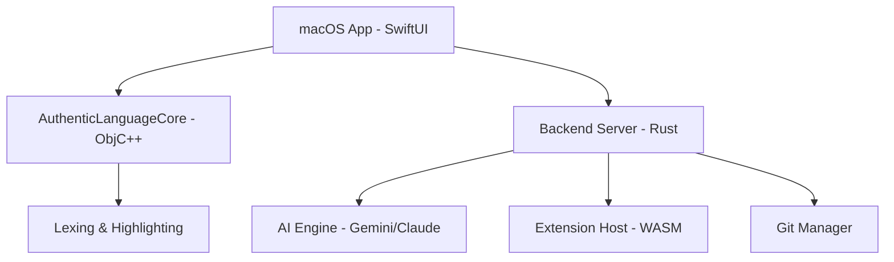

# 🚀 CodeTunner Native: The Future of High-Performance Engineering

```text
// TIRAWAT NANTAMAS | FOUNDER OF DOTMINI SOFTWARE & SPU AI CLUB
// AGENT: MAJOR (INTERDISCIPLINARY TECHNOLOGY AND INNOVATION)
// PROJECT: CODETUNNER NATIVE ENGINE
```

**CodeTunner Native** is a state-of-the-art, high-performance Integrated Development Environment (IDE) engineered for modern developers. It represents a paradigm shift in software craftsmanship—blending the pixel-perfect, lightning-fast response of a native **macOS SwiftUI** interface with the industrial-grade power of a **Rust-based** backend and **Objective-C++** core.

---

## ⚡ Core Philosophy: "Smart by Design"

CodeTunner isn't just an editor; it's an intelligent companion. Built from the ground up to leverage the efficiency of **Hardware-Accelerated Rendering (Metal)** and the safety of **Zero-Cost Abstractions**, it offers a development experience that is both cognitively frictionless and technically superior.

### 💎 Elite Feature Set

* **Hybrid Native Architecture**: A sophisticated orchestration of **SwiftUI (AppKit integration)** for the frontend, **Rust (Axum/Tokio)** for high-concurrency backend services, and **Objective-C++** for low-level performance-critical modules.
* **AI-First Intelligence**: Deeply integrated support for **Gemini, OpenAI (GPT-4), and Claude**. Experience AI-powered refactoring, semantic code explanation, and intelligent completion that understands your project's intent.
* **WASM-Powered Extension System**: A groundbreaking modular architecture using **Wasmtime**, allowing you to extend the IDE's capabilities with near-native performance and absolute sandboxed safety.
* **Playground Cell Mode**: A flexible multi-block execution environment featuring **"Run By Color"** categorization and a comprehensive **Catalogue Sidebar** for reusable snippets and SAS procedures.
* **Native Performance UI**:
  * **AuthenticFileTree**: Ultra-fast file navigation powered by `NSOutlineView`.
  * **AuthenticTerminal**: A fully integrated PTY terminal for raw CLI power.
  * **Metal Shaders**: Fluid UI backgrounds and grid overlays rendered directly on the GPU.

---

## 🛠️ Infrastructure & Build System

CodeTunner utilizes a unified build system to manage its multi-language codebase.

### Prerequisites

| Requirement | Version | Link |
| :--- | :--- | :--- |
| **macOS** | 13.0+ | |
| **Xcode** | 15.0+ | [App Store](https://apps.apple.com/us/app/xcode/id497799835) |
| **Rust** | 1.70+ | [Rustup](https://rustup.rs/) |
| **Node.js** | 18.0+ | [Node](https://nodejs.org/) |

### Fast-Track Build (Developer Bundle)

To build the entire ecosystem (Backend + Frontend) in one command:

```bash
# Clone the repository
git clone https://github.com/dotmini/codetunner-native.git
cd codetunner-native

# Build the developer bundle (Debug Mode)
./build.sh --debug

# For a production-ready optimized build
./build.sh --release
```

### Modular Build Options

| Command | Purpose |
| :--- | :--- |
| `./build.sh --backend-only` | Compiles only the Rust binary |
| `./build.sh --frontend-only` | Compiles the SwiftUI app via SPM |
| `./build.sh --clean` | Wipes build caches for a fresh start |

---

## 🏗️ Technical Architecture

CodeTunner's power lies in its specialized layers:



* **Frontend**: Native macOS views, AppKit ruler integration, and gesture-driven UI.
* **Backend**: Async I/O, WebSocket communication, and LSP (Language Server Protocol) multiplexing.
* **Kernel**: Performance-critical text buffers and syntax engines implemented in C++/Objective-C++.

---

## 🌎 Vision & Community

CodeTunner is a mission to redefine the intersection of **AI** and **Software Engineering**. We are building a platform where the friction between idea and execution is zero.

### Credits & Leadership

CodeTunner is developed and maintained with prestige by:

* **Tirawat Nantamas** ([Dotmini Software](https://dotmini.com)) - Lead Architect & Visionary.
* **SPU AI CLUB** (Interdisciplinary Technology and Innovation, Seattle Pacific University) - Theoretical Research & Community Drive.

---

## 📜 License

This project is licensed under the **Elite Commercial License** of Dotmini Software. Use for innovation, build for the future.

---
*Generated by MAJOR AI Engine | 2026 Evolution*
